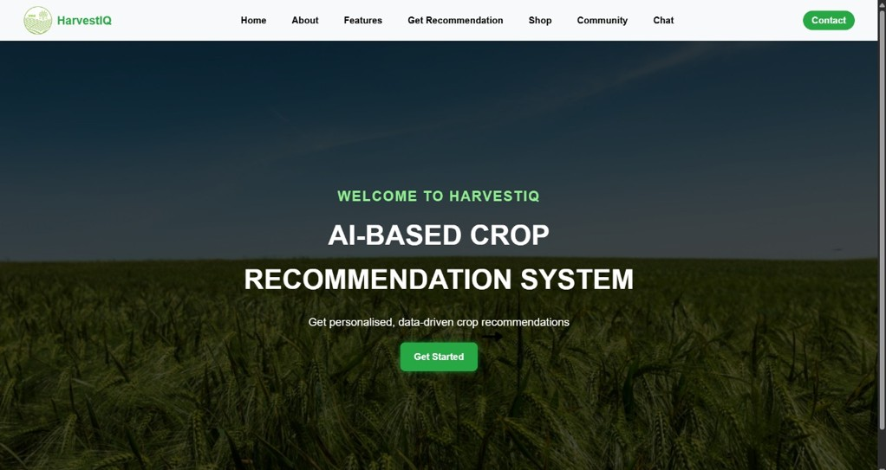
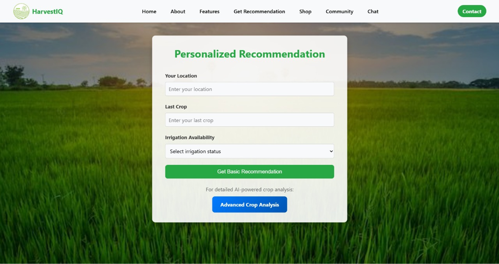
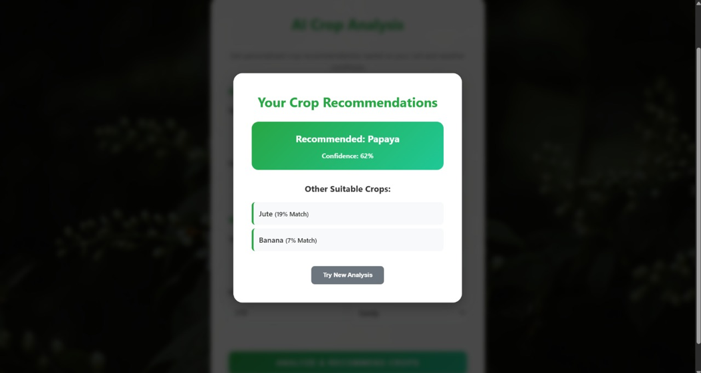

# HarvestIQ: NextGen Crop Prediction via AI/ML

## 📌 Overview
HarvestIQ is a final-year B.Tech project developed by a 4-member team under the Smart India Hackathon (SIH) framework.  
The system leverages **Artificial Intelligence (AI), Machine Learning (ML), and Data Analytics** to provide **data-driven crop recommendations** across **28 Indian states/UTs and 23 crops**.  

By integrating soil health, weather forecasts, rainfall patterns, and historical yield records, HarvestIQ empowers farmers with **real-time, location-specific guidance** on crop selection, fertilizer use, and irrigation practices.

---

## 🚀 Features
- **AI/ML Models:** Random Forest, XGBoost, LightGBM, Neural Networks, LSTM for weather-aware predictions.  
- **Data Scope:** 10–25 years of historical yield data + real-time weather and soil analytics.  
- **Preprocessing:** k-NN imputation, normalization, feature engineering (Agro-Climatic Index, Cost Index, Land-Efficiency Ratio).  
- **Accuracy:** Achieved up to **95% prediction accuracy** with CatBoost and Random Forest; reduced RMSE/MAE by **15–20%** compared to baselines.  
- **Platform:** Multilingual web & mobile interface with **REST APIs (FastAPI)** and secure authentication.  
- **Scalability:** Validated across diverse agro-ecological zones; designed for pan-India deployment.  

---

## 🛠️ Methodology
1. **Data Collection:** Government portals (DES India, FAO, Kaggle), soil surveys, weather services.  
2. **Preprocessing:** Cleaning, encoding, imputation, normalization, feature engineering.  
3. **Model Development:** Training & benchmarking multiple ML models with Bayesian optimization.  
4. **Real-Time Updates:** In-season re-predictions using live weather and soil data.  
5. **Deployment:** REST API backend + farmer-friendly dashboard (web/mobile).  
6. **Validation:** Cross-validation across agro-climatic zones; refinement of feature weights.  

---

## 📊 System Architecture
- **Backend:** FastAPI, Python ML libraries (Scikit-learn, XGBoost, LightGBM, TensorFlow/Keras).  
- **Database:** Structured crop, soil, and weather datasets.  
- **Frontend:** Web & mobile dashboards with multilingual support.  
- **Integration:** REST APIs for secure, scalable communication.  

---

## 🌱 Impact
- **Optimized crop selection** → Higher yields and reduced financial risks.  
- **Smart fertilizer & irrigation recommendations** → Improved resource utilization.  
- **Farmer empowerment** → Accessible advisory services in regional languages.  
- **Climate resilience** → Models adapted to changing weather and soil conditions.  

---

## 🔮 Future Scope
- **Market Intelligence:** Real-time price and demand forecasting.  
- **IoT Integration:** Sensors for soil moisture, pH, and automated irrigation.  
- **Pan-India Deployment:** Scaling across diverse agro-climatic zones.  
- **Global Adaptation:** Extendable to international agricultural datasets.  

---

## 👥 Team
- **Team Members:** 
- Jatin (Backend & System Design)  
- Gaurav Kuriyal (UI Development & Frontend) 
- Hritik Kumar  (Data collection & Research)
- Kunal Saini  (Data Preprocessing)
- **Supervisor:** Ms. Rinki Singh (Assistant Professor, Dept. of CSE, IMS Engineering College)

---

## 📚 References
- Sam & D’Abreo (2023) – Crop recommendation with ML using environmental & economic factors.  
- Apat et al. (2023) – AI-based crop recommendation using soil nutrients and climate data.  
- Banerjee et al. (2023) – Hybrid LSTM + regression model for weather-aware yield prediction.  
- Raza & Bebber (2022) – Climate change and plant pathogens impact on crop yield.  

---

## 🏆 Recognition
HarvestIQ was developed as part of the **Smart India Hackathon (SIH)** problem statement, showcasing innovation in **AI/ML for agriculture** and demonstrating **social impact at national scale**.

---
## 📸 Output Screenshots

### Home Page
)

### Basic Crop Recommendation Interface

### Advanced Crop Recommendation Interface

### Output Interface

